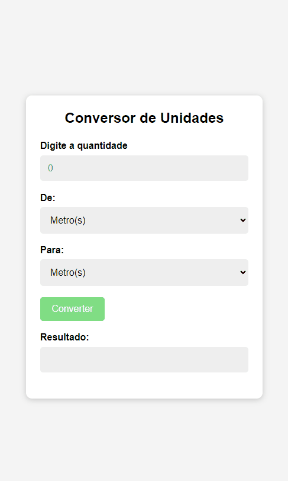

# Conversor de Unidades
É um conversor de unidades , que converte a quantidade escrita em quilômetros, metros ou milímetros

## Funcionalidade
[]

---

## Objetivo
Será digitado o valor que temos (quantidade), diz qual a conversão que quer fazer.Quando clica em converter aparece o resultado na tela e uma mensagem
Alguma metodologias utilizadas:

- DOM
- Eventos Funções
- Condicional

---

## Tecnologias utilizadas

- HTML
- CSS
- JavaScript
- Git
